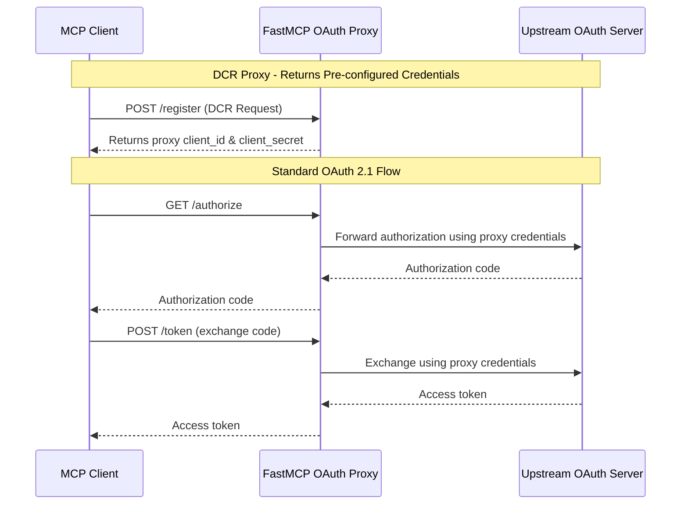

# OAuth Proxy for FastMCP

## Overview

The OAuth Proxy functionality in FastMCP allows you to work with OAuth 2.1 authorization servers that **don't support Dynamic Client Registration (DCR)**. Instead of requiring the upstream OAuth server to support DCR, the proxy stores pre-configured client credentials and returns them when clients attempt registration.

This is particularly useful when integrating with:
- Legacy OAuth providers that predate DCR standards
- Enterprise OAuth systems with restricted DCR support
- Third-party services that require manual client registration

## How It Works

The OAuth Proxy implements a "proxy pattern" for OAuth flows:

1. **DCR Proxy**: When clients attempt Dynamic Client Registration, instead of forwarding to the upstream server, the proxy returns pre-configured client credentials
2. **OAuth Flow Forwarding**: Actual OAuth authorization and token exchange flows are forwarded to the upstream OAuth server using the proxy credentials
3. **Token Management**: The proxy handles local token storage, validation, and revocation



## Configuration

### Environment Variables

The easiest way to configure OAuth proxy is using environment variables:

```bash
# Enable OAuth proxy
FASTMCP_OAUTH_PROXY_ENABLED=true

# Required: Pre-configured client credentials from your OAuth provider
FASTMCP_OAUTH_PROXY_CLIENT_ID=your-client-id-from-oauth-provider
FASTMCP_OAUTH_PROXY_CLIENT_SECRET=your-client-secret-from-oauth-provider

# Required: Upstream OAuth server URL
FASTMCP_OAUTH_PROXY_UPSTREAM_ISSUER_URL=https://auth.example.com

# Optional: Default scopes (comma-separated)
FASTMCP_OAUTH_PROXY_SCOPES=read,write,admin

# Optional: Allowed redirect URIs (comma-separated)
FASTMCP_OAUTH_PROXY_REDIRECT_URIS=http://localhost:3000/callback,https://your-app.com/oauth/callback
```

### Manual Configuration

You can also configure the OAuth proxy programmatically:

```python
from fastmcp import FastMCP
from fastmcp.server.auth.providers.oauth_proxy import OAuthProxyProvider

# Create OAuth proxy provider
oauth_proxy = OAuthProxyProvider(
    upstream_issuer_url="https://auth.example.com",
    proxy_client_id="your-client-id-from-oauth-provider", 
    proxy_client_secret="your-client-secret-from-oauth-provider",
    default_scopes=["read", "write"],
    allowed_redirect_uris=["http://localhost:3000/callback"],
)

# Create FastMCP server with OAuth proxy
mcp = FastMCP("My MCP Server", auth=oauth_proxy)

@mcp.tool()
def protected_tool() -> str:
    """This tool requires OAuth authentication."""
    return "Access granted via OAuth proxy!"
```

## Use Cases

### Enterprise OAuth Integration

Many enterprise OAuth systems don't support DCR due to security policies:

```python
# Enterprise setup with restricted redirect URIs
oauth_proxy = OAuthProxyProvider(
    upstream_issuer_url="https://enterprise-oauth.company.com",
    proxy_client_id="enterprise-app-client-id",
    proxy_client_secret="enterprise-app-client-secret",
    
    # Restrict to approved redirect URIs only
    allowed_redirect_uris=[
        "https://approved-app.company.com/oauth/callback",
        "http://localhost:8080/callback",  # For development
    ],
    
    # Enterprise-specific scopes
    default_scopes=["employee:read", "department:read"],
)
```

### Legacy OAuth Provider Integration

Working with older OAuth providers that predate DCR:

```python
# Legacy provider setup
oauth_proxy = OAuthProxyProvider(
    upstream_issuer_url="https://legacy-auth.example.com",
    proxy_client_id="legacy-app-12345",
    proxy_client_secret="legacy-secret-67890",
    
    # Simple scopes for legacy systems
    default_scopes=["basic"],
    
    # Allow any redirect URI for flexibility
    allowed_redirect_uris=None,
)
```

### Third-Party Service Integration

Integrating with services that require manual client registration:

```python
# Third-party service (e.g., a SaaS provider)
oauth_proxy = OAuthProxyProvider(
    upstream_issuer_url="https://api.saas-provider.com/oauth2",
    proxy_client_id="saas-integration-client",
    proxy_client_secret="saas-integration-secret",
    
    # Service-specific scopes
    default_scopes=["api:read", "api:write", "webhooks:manage"],
    
    # Configure for the service's requirements
    httpx_client_kwargs={
        "timeout": 60.0,  # Longer timeout for external service
        "headers": {"User-Agent": "FastMCP-OAuth-Proxy/1.0"},
    },
)
```

## Complete Example

Here's a complete working example:

```python
#!/usr/bin/env python3
import asyncio
from fastmcp import FastMCP
from fastmcp.server.auth.providers.oauth_proxy import OAuthProxyProvider

async def main():
    # Configure OAuth proxy
    oauth_proxy = OAuthProxyProvider(
        upstream_issuer_url="https://auth.example.com",
        proxy_client_id="your-client-id",
        proxy_client_secret="your-client-secret",
        default_scopes=["read", "write"],
    )
    
    # Create MCP server
    mcp = FastMCP("OAuth Proxy Demo", auth=oauth_proxy)
    
    @mcp.tool()
    def get_user_data() -> dict:
        """Get user data (requires authentication)."""
        return {
            "user_id": "12345",
            "name": "Authenticated User",
            "permissions": ["read", "write"],
        }
    
    @mcp.tool()
    def perform_action(action: str) -> dict:
        """Perform an authenticated action."""
        return {
            "action": action,
            "status": "completed",
            "timestamp": "2024-01-15T10:30:00Z",
        }
    
    # Start the server
    print("Starting OAuth Proxy Demo...")
    print("OAuth Authorization Server metadata: http://localhost:8000/.well-known/oauth-authorization-server")
    print("OAuth Protected Resource metadata: http://localhost:8000/.well-known/oauth-protected-resource")
    print("MCP endpoint: http://localhost:8000/mcp/")
    
    await mcp.run_async(transport="http", host="0.0.0.0", port=8000)

if __name__ == "__main__":
    asyncio.run(main())
```

## OAuth Discovery Endpoints

FastMCP with OAuth proxy provides two standard OAuth discovery endpoints:

### 1. OAuth Authorization Server Metadata (RFC 8414)
```http
GET /.well-known/oauth-authorization-server
```

Returns metadata about the OAuth authorization server including endpoints, supported features, and capabilities:

```json
{
  "issuer": "https://my-mcp-server.com/",
  "authorization_endpoint": "https://my-mcp-server.com/authorize",
  "token_endpoint": "https://my-mcp-server.com/token", 
  "registration_endpoint": "https://my-mcp-server.com/register",
  "revocation_endpoint": "https://my-mcp-server.com/revoke",
  "response_types_supported": ["code"],
  "grant_types_supported": ["authorization_code", "refresh_token"],
  "code_challenge_methods_supported": ["S256"]
}
```

### 2. OAuth Protected Resource Metadata (RFC 8707)
```http
GET /.well-known/oauth-protected-resource
```

Returns metadata about the protected resource (MCP server) for client authentication:

```json
{
  "resource": "https://my-mcp-server.com/",
  "authorization_servers": ["https://my-mcp-server.com/"],
  "scopes_supported": ["read", "write", "admin"],
  "bearer_methods_supported": ["header", "body"],
  "resource_documentation": "https://docs.my-mcp-server.com/"
}
```

**Note**: This endpoint was added to fix compatibility with OAuth clients like Cursor that require RFC 8707 protected resource discovery.

## OAuth Flow Details

### 1. Client Registration (DCR Proxy)

When a client attempts DCR:

```http
POST /register HTTP/1.1
Content-Type: application/json

{
  "client_name": "My MCP Client",
  "redirect_uris": ["http://localhost:3000/callback"],
  "grant_types": ["authorization_code", "refresh_token"]
}
```

The proxy responds with pre-configured credentials:

```http
HTTP/1.1 201 Created
Content-Type: application/json

{
  "client_id": "your-proxy-client-id",
  "client_secret": "your-proxy-client-secret",
  "client_name": "My MCP Client",
  "redirect_uris": ["http://localhost:3000/callback"],
  "grant_types": ["authorization_code", "refresh_token"]
}
```

### 2. Authorization Flow

Standard OAuth 2.1 authorization code flow with PKCE:

```http
GET /authorize?response_type=code&client_id=your-proxy-client-id&redirect_uri=http://localhost:3000/callback&code_challenge=...&state=xyz HTTP/1.1
```

### 3. Token Exchange

The proxy forwards token requests to the upstream server using proxy credentials:

```http
POST /token HTTP/1.1
Content-Type: application/x-www-form-urlencoded

grant_type=authorization_code&
client_id=your-proxy-client-id&
client_secret=your-proxy-client-secret&
code=auth_code_from_proxy&
redirect_uri=http://localhost:3000/callback&
code_verifier=...
```

## Security Considerations

### Client Credential Management

- Store proxy client credentials securely (use environment variables or secure key management)
- Rotate credentials regularly according to your security policy
- Use different proxy credentials for different environments (dev/staging/prod)

### Redirect URI Validation

```python
# Restrict redirect URIs for security
oauth_proxy = OAuthProxyProvider(
    # ... other config ...
    allowed_redirect_uris=[
        "https://trusted-app.com/callback",
        "http://localhost:*",  # Allow any localhost port for development
    ],
)
```

### Scope Management

```python
# Limit available scopes
oauth_proxy = OAuthProxyProvider(
    # ... other config ...
    default_scopes=["read"],  # Conservative default
    # Clients can request additional scopes during authorization
)
```

## Debugging

Enable debug logging to troubleshoot OAuth proxy issues:

```python
import logging
logging.basicConfig(level=logging.DEBUG)

# OAuth proxy will log:
# - DCR requests and responses
# - Upstream token exchanges
# - Token validation and revocation
```

Common debug scenarios:

```bash
# Check OAuth authorization server metadata endpoint
curl http://localhost:8000/.well-known/oauth-authorization-server

# Check OAuth protected resource metadata endpoint (for client compatibility)
curl http://localhost:8000/.well-known/oauth-protected-resource

# Test client registration
curl -X POST http://localhost:8000/register \
  -H "Content-Type: application/json" \
  -d '{"client_name": "Test Client", "redirect_uris": ["http://localhost:3000/callback"]}'

# Verify token endpoint
curl -X POST http://localhost:8000/token \
  -H "Content-Type: application/x-www-form-urlencoded" \
  -d "grant_type=client_credentials&client_id=test&client_secret=test"
```

## Limitations

- **Stateful**: The proxy maintains local state for authorization codes and tokens
- **Single Tenant**: Each proxy instance serves one upstream OAuth server
- **PKCE Support**: Limited PKCE support in current implementation
- **Token Storage**: Tokens are stored in memory (not persistent across restarts)

## Migration from fastapi_mcp

If you're migrating from `fastapi_mcp`, the concepts are similar:

```python
# fastapi_mcp style (conceptual)
fastapi_mcp_proxy = FastApiMCPProxy(
    client_id="proxy-client-id",
    client_secret="proxy-client-secret",
    oauth_server="https://auth.example.com",
)

# FastMCP equivalent
fastmcp_proxy = OAuthProxyProvider(
    upstream_issuer_url="https://auth.example.com",
    proxy_client_id="proxy-client-id", 
    proxy_client_secret="proxy-client-secret",
)
```

The key difference is that FastMCP provides a more comprehensive OAuth 2.1 implementation with better standards compliance. 